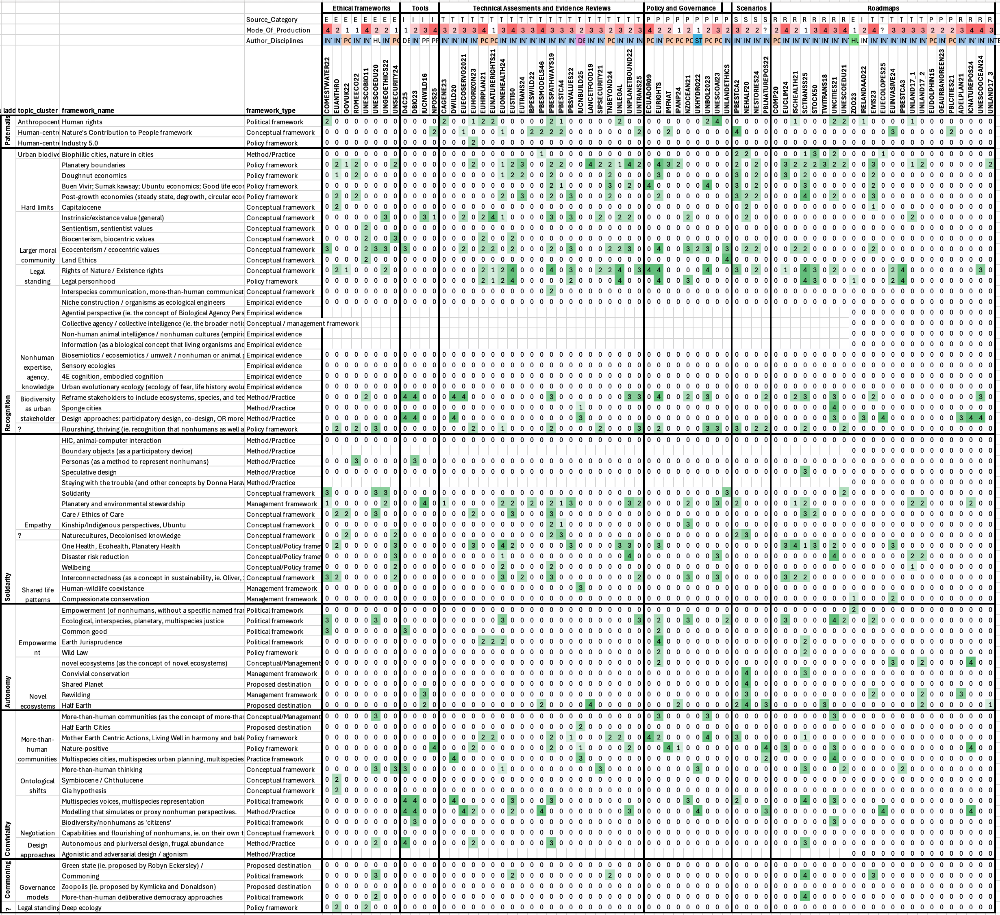

# Populated Ladder

## Relevance Scoring System

**Table 2. Relevance scores**

| Score | Description |
|-------|-------------|
| **−1** | Innovation mentioned as negative or in opposition |
| **0** | Innovation not mentioned OR only related concepts mentioned without the specific innovation OR human-centric application (unless in Paternalism rung) |
| **1** | Innovation explicitly included but appears only in a sentence, list, table, passing reference, or quote, with less than one sentence of engagement |
| **2** | Innovation explicitly discussed with more than one sentence of engagement, but only theoretically or with weak more-than-human application (unless in Paternalism rung) |
| **3** | Innovation used with direct relevance to more-than-human empowerment, AND: explicitly used as core conceptual device OR considers implications and consequences in more-than-human contexts OR explicitly conceptualises how the innovation might empower nonhumans, but lacks concrete policy, practice, or governance mechanisms |
| **4** | Innovation explicitly used for more-than-human empowerment with firm policy or practice implications and detailed, actionable mechanisms (ie. concrete steps, policies, indicators of success, or institutionalisation clearly laid out and feasible for implementation) |

## Ladder Rungs

- [[output.populated-ladder.shallow-paternalism]] - **Shallow paternalism**
    - [[output.populated-ladder.shallow-paternalism.anthropocentric-justice]] - Anthropocentric justice
        - [[output.populated-ladder.shallow-paternalism.anthropocentric-justice.humanrights]] - **HUMANRIGHTS**: Human rights (16 analyses)
    - [[output.populated-ladder.shallow-paternalism.human-centred-sustainability]] - Human-centred sustainability
        - [[output.populated-ladder.shallow-paternalism.human-centred-sustainability.ncp]] - **NCP**: Nature's Contribution to People framework (12 analyses)
        - [[output.populated-ladder.shallow-paternalism.human-centred-sustainability.ind5]] - **IND5**: Industry 5.0 (1 analyses)
- [[output.populated-ladder.recognition]] - **Recognition**
    - [[output.populated-ladder.recognition.urban-biodiversity]] - Urban biodiversity
        - [[output.populated-ladder.recognition.urban-biodiversity.biophillic]] - **BIOPHILLIC**: Biophillic cities, nature in cities (7 analyses)
    - [[output.populated-ladder.recognition.hard-limits]] - Hard limits
        - [[output.populated-ladder.recognition.hard-limits.plantetbounds]] - **PLANTETBOUNDS**: Planatery boundaries (32 analyses)
        - [[output.populated-ladder.recognition.hard-limits.doughnut]] - **DOUGHNUT**: Doughnut economics (13 analyses)
        - [[output.populated-ladder.recognition.hard-limits.beunvivir]] - **BEUNVIVIR**: Buen Vivir; Sumak kawsay; Ubuntu economics; Good life econom; Happiness economy, Wellbeing economy; (10 analyses)
        - [[output.populated-ladder.recognition.hard-limits.postgrowth]] - **POSTGROWTH**: Post-growth economies (steady state, degrowth, circular economy, etc) (14 analyses)
        - [[output.populated-ladder.recognition.hard-limits.capitalocene]] - **CAPITALOCENE**: Capitalocene (3 analyses)
    - [[output.populated-ladder.recognition.larger-moral-community]] - Larger moral community
        - [[output.populated-ladder.recognition.larger-moral-community.intrinsic]] - **INTRINSIC**: Instrinsic/existance value (general) (16 analyses)
        - [[output.populated-ladder.recognition.larger-moral-community.sentientism]] - **SENTIENTISM**: Sentientism, sentientist values (1 analyses)
        - [[output.populated-ladder.recognition.larger-moral-community.biocenterism]] - **BIOCENTERISM**: Biocenterism, biocentric values (4 analyses)
        - [[output.populated-ladder.recognition.larger-moral-community.ecocenterism]] - **ECOCENTERISM**: Ecocenterism / ecocentric values (25 analyses)
        - [[output.populated-ladder.recognition.larger-moral-community.landethics]] - **LANDETHICS**: Land Ethics (2 analyses)
    - [[output.populated-ladder.recognition.legal-standing]] - Legal standing
        - [[output.populated-ladder.recognition.legal-standing.rightsofnature]] - **RIGHTSOFNATURE**: Rights of Nature / Existence rights (25 analyses)
        - [[output.populated-ladder.recognition.legal-standing.legalperson]] - **LEGALPERSON**: Legal personhood (13 analyses)
    - [[output.populated-ladder.recognition.nonhuman-expertise-agency-knowledge]] - Nonhuman expertise / agency / knowledge
        - [[output.populated-ladder.recognition.nonhuman-expertise-agency-knowledge.mthcommunication]] - **MTHCOMMUNICATION**: Interspecies communication, more-than-human communication (2 analyses)
        - **NICHECONSTRUCTION**: Niche construction / organisms as ecological engineers (no data)
        - **AGENTIALPERSPECTIVE**: Agential perspective (ie. the concept of Biological Agency Perspective as a counterpoint to Modern Synthesis) (no data)
        - **COLLECTIVEAGENCY**: Collective agency / collective intelligence (ie. the broader notion that agency is not just property of the human mind but can be distributed to collectives of humans and also collectives of nonhumans) (no data)
        - **ANIMALCULTURES**: Non-human animal intelligence / nonhuman cultures (empirical evidence not just cultures as a human concept that considers animals) (no data)
        - **INFORMATION**: Information (as a biological concept that living organisms and collective systems must intepret and assess) (no data)
        - **BIOSEMIOTICS**: Biosemiotics / ecosemiotics / umwelt / nonhuman or animal perceptual worlds (no data)
        - **SENSORY**: Sensory ecologies (no data)
        - **COGNITION**: 4E cognition, embodied cognition (no data)
        - **ECOEVO**: Urban evolutionary ecology (ecology of fear, life history evolution) (no data)
    - [[output.populated-ladder.recognition.biodiversity-as-urban-stakeholder]] - Biodiversity as urban stakeholder
        - [[output.populated-ladder.recognition.biodiversity-as-urban-stakeholder.mthstakeholders]] - **MTHSTAKEHOLDERS**: Reframe stakeholders to include ecosystems, species, and technologies (17 analyses)
        - [[output.populated-ladder.recognition.biodiversity-as-urban-stakeholder.spongecities]] - **SPONGECITIES**: Sponge cities (2 analyses)
        - [[output.populated-ladder.recognition.biodiversity-as-urban-stakeholder.mthdesign]] - **MTHDESIGN**: Design approaches: participatory design, co-design, OR more-than-human, interspecies, ecocentric, animal-aided design, design for biodiversity, net-positive design (10 analyses)
    - [[output.populated-ladder.recognition.unknown]] - ?
        - [[output.populated-ladder.recognition.unknown.thriving]] - **THRIVING**: Flourshing, thriving (ie. recognition that nonhumans as well as humans can flourish and thrive) (16 analyses)
- [[output.populated-ladder.solidarity]] - **Solidarity**
    - [[output.populated-ladder.solidarity.empathy]] - Empathy
        - **HIC**: HIC, animal-computer interaction (no data)
        - **BOUNDARYOBJECTS**: Boundary objects (as a participatory device) (no data)
        - [[output.populated-ladder.solidarity.empathy.personas]] - **PERSONAS**: Personas (as a method to represent nonhumans) (2 analyses)
        - [[output.populated-ladder.solidarity.empathy.speculative]] - **SPECULATIVE**: Speculative design (1 analyses)
        - **STAYINGWITHTHETROUBLE**: Staying with the trouble (and other concepts by Donna Haraway) (no data)
        - [[output.populated-ladder.solidarity.empathy.solidarity]] - **SOLIDARITY**: Solidarity (5 analyses)
        - [[output.populated-ladder.solidarity.empathy.stewardship]] - **STEWARDSHIP**: Planatery and environmental stewardship (20 analyses)
        - [[output.populated-ladder.solidarity.empathy.care]] - **CARE**: Care / Ethics of Care (8 analyses)
        - [[output.populated-ladder.solidarity.empathy.kinship]] - **KINSHIP**: Kinship/Indigenous perspectives, Ubuntu (4 analyses)
    - [[output.populated-ladder.solidarity.empathy-maybe]] - Empathy (maybe?)
        - [[output.populated-ladder.solidarity.empathy-maybe.naturecultures]] - **NATURECULTURES**: Naturecultures, Decolonised knowledge (5 analyses)
    - [[output.populated-ladder.solidarity.shared-life-patterns]] - Shared life patterns
        - [[output.populated-ladder.solidarity.shared-life-patterns.onehealth]] - **ONEHEALTH**: One Health, Ecohealth, Planatery Health (15 analyses)
        - [[output.populated-ladder.solidarity.shared-life-patterns.risk]] - **RISK**: Disaster risk reduction (7 analyses)
        - [[output.populated-ladder.solidarity.shared-life-patterns.wellbeing]] - **WELLBEING**: Wellbeing (5 analyses)
        - [[output.populated-ladder.solidarity.shared-life-patterns.interconnectedness]] - **INTERCONNECTEDNESS**: Interconnectedness (as a concept in sustainability, ie. Oliver, 2020) (13 analyses)
        - [[output.populated-ladder.solidarity.shared-life-patterns.coexistance]] - **COEXISTANCE**: Human-wildlife coexistance (1 analyses)
        - [[output.populated-ladder.solidarity.shared-life-patterns.compassionate]] - **COMPASSIONATE**: Compassionate conservation (2 analyses)
- [[output.populated-ladder.autonomy]] - **Autonomy**
    - [[output.populated-ladder.autonomy.empowerment]] - Empowerment
        - [[output.populated-ladder.autonomy.empowerment.empowerment]] - **EMPOWERMENT**: Empowerment (of nonhumans, without a specific named framework) (1 analyses)
        - [[output.populated-ladder.autonomy.empowerment.ecojustice]] - **ECOJUSTICE**: Ecological, interspecies, planetary, multispecies justice (11 analyses)
        - [[output.populated-ladder.autonomy.empowerment.commongood]] - **COMMONGOOD**: Common good (4 analyses)
        - [[output.populated-ladder.autonomy.empowerment.earthjurisprudence]] - **EARTHJURISPRUDENCE**: Earth Jurisprudence (5 analyses)
        - [[output.populated-ladder.autonomy.empowerment.wildlaw]] - **WILDLAW**: Wild Law (2 analyses)
    - [[output.populated-ladder.autonomy.novel-ecosystems]] - Novel ecosystems
        - [[output.populated-ladder.autonomy.novel-ecosystems.novelecosystems]] - **NOVELECOSYSTEMS**: novel ecosystems (as the concept of novel ecosystems) (4 analyses)
        - [[output.populated-ladder.autonomy.novel-ecosystems.convivial]] - **CONVIVIAL**: Convivial conservation (2 analyses)
        - [[output.populated-ladder.autonomy.novel-ecosystems.sharedplanet]] - **SHAREDPLANET**: Shared Planet (1 analyses)
        - [[output.populated-ladder.autonomy.novel-ecosystems.rewilding]] - **REWILDING**: Rewilding (6 analyses)
    - [[output.populated-ladder.autonomy.novel-ecosystems-as-a-response]] - Novel ecosystems (as a response)
        - [[output.populated-ladder.autonomy.novel-ecosystems-as-a-response.halfhearth]] - **HALFHEARTH**: Half Earth (10 analyses)
- [[output.populated-ladder.conviviality]] - **Conviviality**
    - [[output.populated-ladder.conviviality.more-than-human-communities]] - More-than-human communities
        - [[output.populated-ladder.conviviality.more-than-human-communities.mthcommunities]] - **MTHCOMMUNITIES**: More-than-human communities (as the concept of more-than-human communities) (4 analyses)
        - [[output.populated-ladder.conviviality.more-than-human-communities.halfhearthcities]] - **HALFHEARTHCITIES**: Half Earth Cities (1 analyses)
        - [[output.populated-ladder.conviviality.more-than-human-communities.motherearth]] - **MOTHEREARTH**: Mother Earth Centric Actions, Living Well in harmony and balance with Mother Earth, rights of Mother Earth (Pacha mama) to preserve its condition of regeneration (11 analyses)
        - [[output.populated-ladder.conviviality.more-than-human-communities.naturepositive]] - **NATUREPOSITIVE**: Nature-positive (11 analyses)
        - [[output.populated-ladder.conviviality.more-than-human-communities.mthcities]] - **MTHCITIES**: Multispecies cities, multispecies urban planning, multispecies disaster preparedness (4 analyses)
    - [[output.populated-ladder.conviviality.ontological-shifts]] - Ontological shifts
        - [[output.populated-ladder.conviviality.ontological-shifts.mththinking]] - **MTHTHINKING**: More-than-human thinking (9 analyses)
        - [[output.populated-ladder.conviviality.ontological-shifts.symbiocene]] - **SYMBIOCENE**: Symbiocene / Chthulucene (1 analyses)
        - [[output.populated-ladder.conviviality.ontological-shifts.gia]] - **GIA**: Gia hypothesis (1 analyses)
    - [[output.populated-ladder.conviviality.negotiation]] - Negotiation
        - [[output.populated-ladder.conviviality.negotiation.mthvoices]] - **MTHVOICES**: Multispecies voices, multispecies representation (8 analyses)
        - [[output.populated-ladder.conviviality.negotiation.mthmodelling]] - **MTHMODELLING**: Modelling that simulates or proxy nonhuman perspectives. (11 analyses)
        - [[output.populated-ladder.conviviality.negotiation.mthcitizens]] - **MTHCITIZENS**: Biodiversity/nonhumans as 'citizens' (2 analyses)
        - **MTHCAPABILITIES**: Capabilities and flourishing of nonhumans, ie. on their own terms (no data)
    - [[output.populated-ladder.conviviality.design-approaches]] - Design approaches
        - [[output.populated-ladder.conviviality.design-approaches.pluriversal]] - **PLURIVERSAL**: Autonomous and pluriversal design, frugal abundance (5 analyses)
        - **AGONISM**: Agonistic and adversarial design / agonism (no data)
- [[output.populated-ladder.commoning]] - **Commoning**
    - [[output.populated-ladder.commoning.governance-models]] - Governance models
        - **GREENSTATE**: Green state (ie. proposed by Robyn Eckersley) / (no data)
        - [[output.populated-ladder.commoning.governance-models.commoning]] - **COMMONING**: Commoning (5 analyses)
        - **ZOOPOLIS**: Zoopolis (ie. proposed by Kymlicka and Donaldson) (no data)
        - [[output.populated-ladder.commoning.governance-models.mthdeliberative]] - **MTHDELIBERATIVE**: More-than-human deliberative democracy approaches (2 analyses)
- [[output.populated-ladder.unknown]] - **?**
    - [[output.populated-ladder.unknown.legal-standing]] - Legal standing
        - [[output.populated-ladder.unknown.legal-standing.deepecology]] - **DEEPECOLOGY**: Deep ecology (2 analyses)

## Navigation

- [[output]] - Back to Analysis Results
- [[root]] - Back to Root
